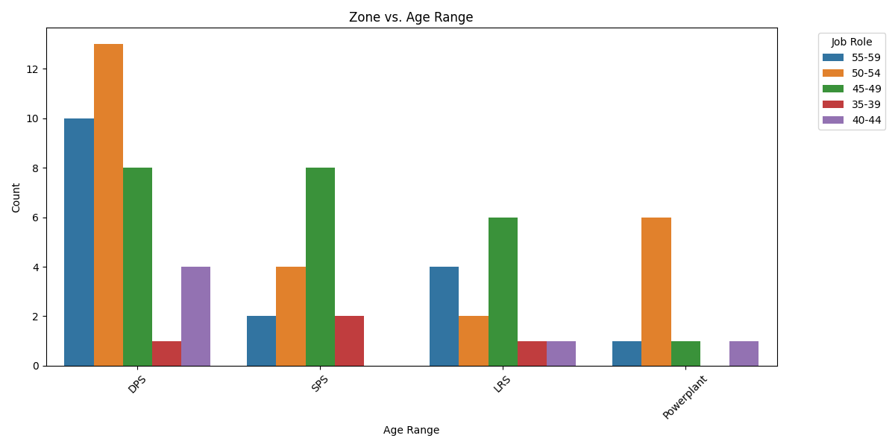
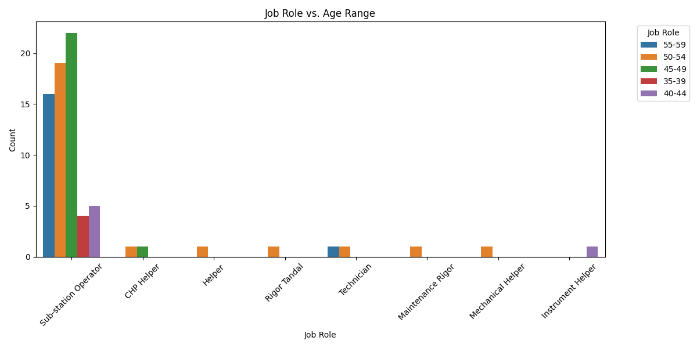
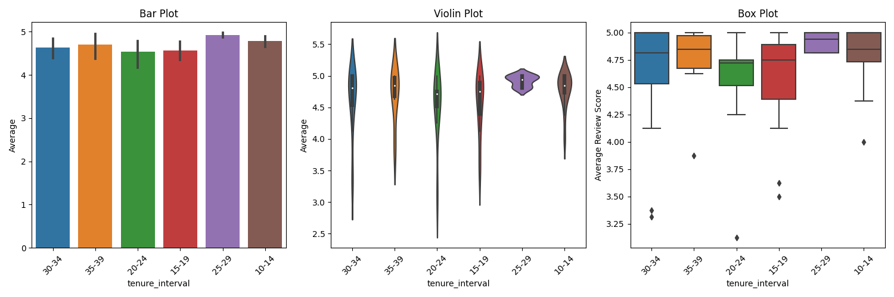
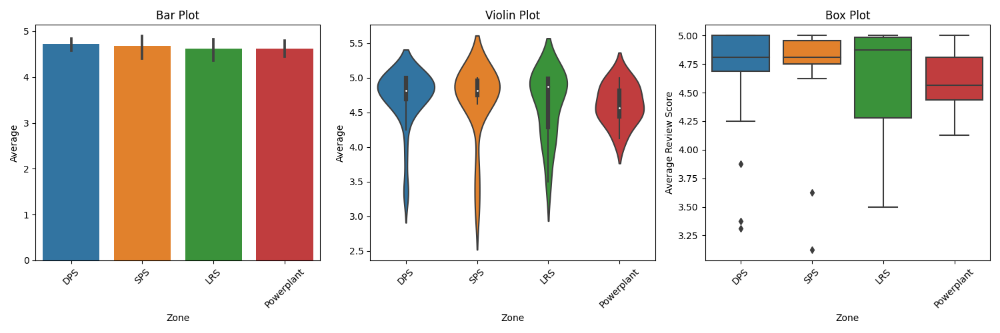

## Approach
1. Loaded the xlsx file using pandas in jupyter-notebook
2. Performed Data cleaning:
  1. Removed last few columns coz they had nan in all to columns
  2. Dropped last column(extra-comments) since it had text reviews which can be analysed by using NLP by sensing the tone which I dont think was in the scope for this assessment
  3. Replaced reviews with their actual score i.e.
  ```
  {'Strongly Disagree': 1,'Strongly disagree': 1, 'Disagree': 2,'Neutral': 3,'Agree': 4, 'Strongly Agree': 5, 'Strongly agree':5}
  ```
  4. Replaced nan values with median of that column since data is very less it doesnt make sense to drop rows with nan values
  5. Converted age from X years Y months to age interval eg : 47 Years 3 Months goes to 45-49 age interval
  6. Converted tenure to intervals of 5 each
3. Applied Anova test and T Test on each category of reviews according to Age, Zone and Tenure
4. Visualized results in terms of Bar Plot, Violen Plot,Box Plot, CountPlots


### Visualization and Interpretations:
#### CountPlots:

**Age Range vs Zone**


Interpretations: Lot of people as well as a Lot of diversity in terms of age in zone='DPS'

**Age Range vs Job Role**


Interpretations: Lot of people as well as a Lot of diversity in terms of age in Job Role='Sub-station operator'

#### Bar Plot, Violen Plot,Box Plot:
**Age Range vs Reviews**


Interpretations: People With age group 45-49 seems to be least satisfied while people age group 50-54 seems most satisfied, however the result is very close to conclude reviews based on age groups.
Median generally lies on thicker part middle of violin plot however for age group 45-49 and 35-39 it is elongated because of high variance in the data.

**Job Role vs Reviews**


Interpretations: People With job role 'Rigor Tandal' seems to be least satisfied while People With job role 'Helper' seems most satisfied.
High review variance in Job Role of 'Sub Station operator' while other seems to have very less data in there category.

**Tenure vs Reviews**


Interpretations: People With tenure interval 20-24 seems to be least satisfied while People With tenure interval 25-29 seems most satisfied.
High review variance in all tenure level while tenure 25-29 have less variance

**Zone vs Reviews**


Interpretations: Seams equally distributed, hence cannot predict which zone is lagging behind in terms of employee reviews
Low variance for zone 'PowerPlant' while high variance for DPS, SPS and LRS zones

### Visualization and Interpretations:(Exact output in notebook )
Anova test and T Test were performed on the review data considering all reviews as same for H0 while vice versa for H1

0. General result:
  Columns like I am satisfied with company’s leave policy (sick leave, paid leave etc) and I get my salary/wages on time have same value in each row hence nan values were received in Anova test and f-test

1. Test according to Zone:
  H0 seems to be valid for columns "I receive clear instructions and guidance from my supervisors, I feel comfortable approaching my supervisors with questions or concerns" etc since the values are closer to 1 while H0 is less likely to be valid for columns like "Safety training is conducted on a regular basis for all employees." etc which have values of test much greater than 1

2. Test according to Age-interval:
  H0 seems to be valid for columns "I receive clear instructions and guidance from my supervisors, I feel comfortable approaching my supervisors with questions or concerns." etc since the values are closer to 1 while H0 is less likely to be valid for columns like "I get the opportunity to participate in a structured training program conducted in the Organization." etc which have values of test much greater than 1

3. Test according to Tenure-interval:
  H0 seems to be valid for columns "I get the opportunity to participate in a structured training program conducted in the Organization. I get on the job training by my supervisor" etc since the values are closer to 1 while H0 is less likely to be valid for columns like "I try to acquire new knowledge and new skills through self learning and peer learning." etc which have values of test much greater than 1
